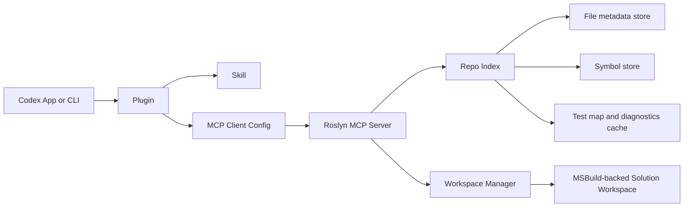
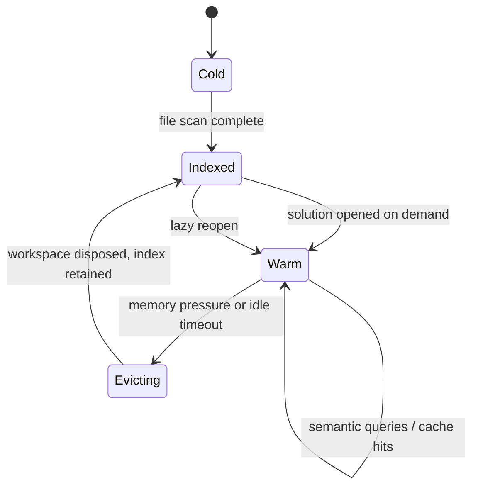

# Roslyn-backed Codex Integration for App-first Workflows

## Executive summary

The strongest architecture for a Roslyn-backed Codex integration is a **hybrid app-first design**: package the integration as a **Codex plugin** that installs one or more **skills** plus an **MCP server definition**, but run the heavy Roslyn engine as a **long-lived local daemon** behind that MCP entrypoint. In practice, that gives you the low-friction installation and discoverability of Codex plugins, the context-efficient workflow guidance of skills, and the latency, cache reuse, and multi-solution lifecycle control of a persistent server. Codex already supports plugin manifests that bundle `.mcp.json`, skills, hooks, and assets; MCP servers can be configured through `config.toml` for either **stdio** or **Streamable HTTP**; and Codex app-server exists specifically for deeper product integrations with authentication, approvals, conversation history, and streamed events. citeturn33view0turn37view1turn33view2turn33view4

For the Roslyn layer itself, the correct default is **index-first, workspace-second**. Roslyn’s workspace model gives full-fidelity access to source text, syntax trees, semantic models, and compilations across entire solutions; solutions are immutable snapshots; and projects expose compilations without the caller managing dependencies manually. But opening large MSBuild-backed solutions remains the expensive path, so the daemon should answer many common discovery requests from an on-disk file-and-symbol index first, and only go to a live workspace when semantics are required. Roslyn’s APIs also provide natural invalidation primitives: projects expose semantic versions that change when consumable declarations change, compilations are reused on repeated calls, semantic models cache local symbols/semantic data but can hold substantial memory if kept too long, and documents can expose cached semantic models when available. citeturn24view0turn24view2turn24view4turn23view1turn23view2turn23view9turn23view0

For the external tool contract, use **many small, typed, toggleable MCP tools**, not one giant omnibus tool. MCP tools support JSON-Schema-based `inputSchema` and optional `outputSchema`, cursor-based pagination, and tool annotations such as `readOnlyHint`, `destructiveHint`, and `idempotentHint`; those are exactly the primitives needed to expose rich Roslyn capabilities safely and selectively. The best default tool set for the 90th percentile is: `symbol_at`, `hover`, `goto_definition`, `find_references`, `find_declarations`, `type_hierarchy`, `diagnostics`, `semantic_diff`, `impacted_tests`, and `propose_rename`. Heavier or riskier operations such as code fixes, formatting, document rename cascades, and broad solution-wide refactors should be available but disabled by default or gated behind explicit approval. citeturn31search2turn30view0turn30view1turn30view4turn30view6turn30view8turn31search1

Token efficiency should be designed in from the start. Codex and the OpenAI API reward **static prefixes**, **structured outputs**, **stable tool schemas**, and **compaction-friendly turn histories**. Prompt caching works for prompts of 1,024+ tokens, caches message arrays, tool definitions, and structured-output schemas, and works best when repeated content is placed first and dynamic content last. Structured Outputs enforce schema adherence, which is exactly what you want for tool summaries and change proposals. For long-running coding sessions, the Responses API supports server-side and standalone **compaction**, with explicit guidance to keep the compacted window as the canonical next context. citeturn36view2turn36view4turn36view3turn34view2turn34view0

The highest-confidence recommendation, therefore, is this: **ship a plugin that bundles a skill and MCP config, but standardise operational deployment on a local HTTP daemon for app-first use, with stdio as the compatibility fallback.** Keep the semantic universe **per solution**, share as much as possible in the **repo-level index and cache layers**, and make all mutating Roslyn operations follow a **proposal/apply** pattern over immutable solution snapshots. citeturn33view0turn33view2turn24view2turn23view8

## Recommended integration architecture

The practical target is a four-layer system: **Codex surface**, **MCP contract**, **Roslyn daemon**, and **repo index/cache layer**. The plugin gives installation, discovery, and defaults. Skills provide progressive-disclosure instructions with very low standing-context cost: Codex only starts with each skill’s name, description, and file path, and loads the full `SKILL.md` only when it chooses the skill. The initial skill list is capped at roughly 2% of the model context window, or 8,000 characters when the context window is unknown, which makes a small “Roslyn navigation and refactor workflow” skill a very efficient way to teach Codex how to use your tools. citeturn19view0turn19view1turn19view2

The daemon should be the semantic authority. Codex’s MCP configuration supports both **stdio** and **Streamable HTTP** transports, per-server timeouts, per-tool approval policy, tool allow/deny lists, and bearer-token environment variables for HTTP servers. That makes HTTP the better app-first default because it allows warm reuse across sessions, shared caches, and easier observability, while stdio remains the best fallback for simple local CLI flows and for environments where process parenting is preferable. MCP’s authorization spec also draws a useful line: HTTP transports may use transport-level authorization, while stdio implementations should not use the HTTP auth flow and instead obtain credentials from the environment. citeturn33view2turn33view3turn32search2



The deepest integration option is **Codex app-server**, not MCP. Codex app-server is the interface used for rich clients, supports authentication, conversation history, approvals, and streamed agent events, and can run over stdio, WebSocket, or Unix sockets. That is the right choice only if you are building your own Codex-like client experience or embedding Codex inside a larger product. For the specific problem here, app-server is useful as a future path, but **MCP is the correct initial control plane** because Roslyn features naturally map to discoverable typed tools. citeturn33view4turn18view1turn18view2

### Integration mode comparison

| Mode | What it is | Strengths | Weaknesses | Recommended use |
|---|---|---|---|---|
| Plugin with stdio MCP | Plugin bundles `.mcp.json`; Codex starts a child process MCP server | Easiest install story; natural for CLI and IDE; no separate service management; per-project isolation | Cold starts on every session; weak cache reuse; harder multi-solution warm state; less suitable for app-first UX | **Fallback** and first compatibility target |
| Plugin with HTTP daemon MCP | Plugin points to long-lived local HTTP MCP server | Best latency after warmup; strong cache/workspace reuse; simple app-first experience; better telemetry and memory orchestration | Needs service lifecycle, loopback auth, and version coordination | **Recommended default** |
| Skill-only | No custom server, only `SKILL.md` workflows/instructions | Very low complexity; highly token-efficient discovery; great for teaching workflows | No semantic power beyond existing tools; cannot expose Roslyn APIs directly | Good supplement, not sufficient alone |
| Custom client via Codex app-server | Your app speaks app-server directly to Codex | Maximum control; rich UX; streamed turn events; approvals/history built in | Highest engineering cost; broader product scope than a semantic tool server | Future phase for full custom app experience |

This comparison follows directly from Codex’s plugin packaging rules, skills behaviour, MCP transport configuration, and the role of app-server for rich clients. citeturn33view0turn19view2turn33view2turn33view4

### Recommended default

For the first serious release, use this default stack:

1. **Plugin** for distribution and defaults.
2. **One small skill** named something like `dotnet-semantic-assist`.
3. **Local HTTP MCP daemon** as primary.
4. **Stdio MCP server** as fallback bootstrap mode.
5. **No direct app-server dependency** in v1, but preserve room for it in the internal abstractions.

That choice is an inference from the transport and packaging capabilities above plus Roslyn’s cache and workspace behaviour: the more semantic state you want to reuse, the more you want a persistent process boundary instead of per-session stdio startup. citeturn33view0turn33view2turn23view1turn23view9

## Roslyn capability scope

Roslyn’s workspaces layer is explicitly the starting point for analysis and refactoring over whole solutions, and it exposes commonly used features such as Find All References, formatting, and code generation over top of source text, syntax trees, semantic models, and compilations. Roslyn also offers first-class APIs for symbol lookup at a position, declaration search, reference search, renaming, source-generated documents, and diagnostics. Those are the capabilities worth shaping into tools. citeturn24view0turn21view0turn23view5turn23view6turn23view7turn23view8turn23view4

### Priority split

| Tier | Tool / feature | Reason |
|---|---|---|
| Default 90th-percentile | `symbol_at` | Core primitive for almost every semantic operation |
| Default 90th-percentile | `hover` | Cheap, high-value semantic summary for local context |
| Default 90th-percentile | `goto_definition` | Navigation baseline |
| Default 90th-percentile | `find_references` | One of the most common whole-solution semantic actions |
| Default 90th-percentile | `find_declarations` | Search by name across source, references, and metadata |
| Default 90th-percentile | `type_hierarchy` | High value for object-model understanding |
| Default 90th-percentile | `diagnostics` | Essential before and after edits |
| Default 90th-percentile | `semantic_diff` | Better than raw text diff for explaining changes |
| Default 90th-percentile | `propose_rename` | High-value refactor with clear preview/apply semantics |
| Default 90th-percentile | `impacted_tests` | Strong practical value for coding agents |
| Optional | `document_symbols` / `outline` | Cheap and useful, but redundant if index search is strong |
| Optional | `code_fixes` | Useful but larger surface and approval complexity |
| Optional | `format_document` / `format_span` | Valuable, but best after apply/approval |
| Optional | `rename_document` cascade | More risk and UX complexity |
| Optional | `generated_sources` | Useful in advanced debugging, not everyday |
| Optional | `dataflow` / `controlflow` | Powerful, but niche relative to navigation/refactor flows |
| Optional | `public_api_diff` | Valuable for library repos, not universal |
| Optional | `source_generator_trace` | Specialist workflow |

The split above is recommended because it aligns with the most common Roslyn-enabled IDE workflows described in Roslyn’s overview—IntelliSense-style lookup, Go to Definition, Find All References, intelligent rename, diagnostics, and code analysis—and with the concrete public APIs available for symbol-at-position, declaration search, reference search, and rename. citeturn21view0turn23view5turn23view6turn23view7turn23view8

### Tool toggling defaults

MCP supports tool annotations and JSON-Schema-defined inputs/outputs, while Codex supports per-server tool allow lists, deny lists, and per-tool approval modes. That makes it straightforward to expose “most Roslyn features” while keeping the default surface tight. The right defaults are:

- **Enabled and read-only:** navigation, lookup, diagnostics, hierarchy, semantic diff, impacted tests.
- **Enabled but prompt/approve:** rename preview, rename apply, code fixes apply, format apply.
- **Disabled by default:** broad rewrite or cleanup tools that can touch many files without a narrow prior query.

This is both safer and more token-efficient, because it steers the model toward narrow semantic calls before broad edit operations. citeturn31search2turn33view2turn33view3

## Indexing and workspace strategy

The index should be designed to answer the questions that do **not** require a live semantic model. Roslyn workspaces are powerful, but the expensive part is loading/building enough of the solution graph to answer semantic queries. Because solutions are immutable snapshots, projects expose compilations directly, compilations are reused on repeated calls, and semantic models cache semantic state but can retain significant memory, the daemon should keep live workspaces only for hot solutions and answer everything else from a persistent repo-level index. citeturn24view2turn23view1turn23view9

### On-disk indexing design

A robust layout is a **repo-scoped SQLite index** in WAL mode, plus a small content-addressed blob area for large text fragments or compressed snippets. The index should have these logical tables:

| Table | Key columns | Purpose |
|---|---|---|
| `files` | `file_id`, `repo_rel_path`, `kind`, `tracked_state`, `generated_state`, `last_hash` | Canonical file inventory |
| `file_versions` | `file_id`, `content_hash`, `size_bytes`, `mtime_utc`, `line_count` | Change detection and provenance |
| `decl_symbols` | `symbol_id`, `file_id`, `span`, `kind`, `name`, `container`, `accessibility` | Index declarations fast |
| `symbol_edges` | `from_symbol_id`, `edge_kind`, `to_symbol_id` | Base types, interface impls, containment |
| `project_membership` | `file_id`, `project_key`, `solution_key` | Multi-solution mapping |
| `test_map` | `test_symbol_id`, `target_symbol_id`, `strength` | Impact estimation |
| `diag_cache` | `project_key`, `version_key`, `diag_json` | Fast diagnostics reuse |
| `snippets` | `blob_id`, `encoding`, `payload` | Optional small contextual excerpts |

That format is a recommendation, but it follows from the split between repo-wide discovery and workspace-backed semantics exposed by Roslyn’s workspace APIs. citeturn24view0turn24view2

### Incremental updates, hashing, and watch strategy

Use a three-stage invalidation pipeline:

1. **Watcher hint:** `FileSystemWatcher` signals possible changes quickly.
2. **Metadata precheck:** compare file length and mtime.
3. **Content confirmation:** recompute the content hash only when metadata changed or an event was ambiguous.

This avoids treating file events as authoritative. `FileSystemWatcher` can report short 8.3 names on some systems, which is a strong reason to treat it as a trigger rather than the source of truth. citeturn27view0

For schedule, prefer a **hybrid watcher + debounce + periodic reconciliation** model. Watchers give sub-second responsiveness; a periodic scan repairs missed or coalesced events; and a full rescan is triggered on branch switch, restore, checkout, or daemon restart. The periodic reconciliation pass should also re-read `.gitignore`, `$GIT_DIR/info/exclude`, and any configured global excludes because Git’s ignore behaviour is hierarchical and precedence-based. Git also makes two important edge cases explicit: already tracked files are unaffected by `.gitignore`, and you cannot re-include a file if a parent directory is excluded. citeturn28view0turn28view1turn28view2turn28view3

### Generated files and source-generated documents

Generated code should be modelled in three classes:

- **Materialised generated files on disk** such as `.designer.cs` and `.generated.cs`.
- **Custom generated files marked in `.editorconfig`** via `generated_code = true`.
- **Roslyn `SourceGeneratedDocument`** instances created by source generators.

Roslyn’s analyzer and tooling guidance says generated files are identified by filename, extension, or autogenerated headers by default, and users can extend that classification in EditorConfig. Roslyn also exposes `SourceGeneratedDocument` explicitly as a document generated by an `ISourceGenerator`. The consequence for your index is simple: keep generated code **discoverable but de-prioritised** by default, and expose an explicit `include_generated` flag on tools that can return large result sets. citeturn29view0turn29view1turn29view3turn23view4

### Multi-solution strategy

For multiple solutions in one repo, use a **repo-wide shared index** and **per-solution live workspaces**. Do **not** default to one giant unified Roslyn workspace spanning every solution, because whole-solution semantics are defined around a particular project graph, compiler options, references, and MSBuild evaluation context. Roslyn’s workspace model is the representation of a specific solution; solutions are immutable snapshots; and projects expose compilations within that graph. A unified workspace should therefore be an optimisation only when multiple solutions resolve to the same underlying project graph and global properties, not the baseline design. citeturn24view0turn24view2turn24view4

Recommended keys:

- `repo_key = canonical_repo_root`
- `solution_key = hash(repo_key, solution_path, global_props, tfm_filter, configuration, platform, sdk_fingerprint)`
- `project_key = hash(solution_key, project_path, target_framework, lang_version, define_constants)`

Then share these caches across workspaces where possible:

- parsed file text and syntax tree cache by `content_hash`
- declaration index by `repo_key`
- test map by `repo_key`
- diagnostics cache by `project_key + dependent semantic version`
- hot compilation/semantic model cache by `project_key + version`

The crucial Roslyn primitive here is `Project.GetDependentSemanticVersionAsync`, which changes whenever the consumable declarations of the project or its dependencies change. That is an excellent invalidation key for downstream semantic caches. citeturn23view2

### Stable symbol identifiers

Use two symbol identifiers:

- **Internal live handle:** daemon-local, valid only while the workspace is loaded.
- **Stable external symbol ID:** safe to send through MCP and cache between calls.

For the stable external ID, the best public Roslyn anchor for named declarations is `DocumentationCommentId.CreateDeclarationId`, because Roslyn explicitly documents it as an ID string for identifying declarations of types, namespaces, methods, properties, and similar symbols. Build your external ID around that, for example:

```text
sym:v1:{assembly-or-project}:{docCommentId}
```

For symbols that do not have stable declaration IDs—locals, labels, anonymous functions, tuple elements, some generated members—fall back to a location-based encoding:

```text
loc:v1:{repoRelPath}:{startLine}:{startCol}:{endLine}:{endCol}:{syntaxKind}:{fileHashPrefix}
```

That is an inference, but it is strongly supported by Roslyn’s explicit declaration-ID API and by the fact that semantic models provide reference equality locally while solutions and compilations are immutable snapshots that can be recreated. citeturn23view3turn23view9turn24view2

### Workspace lifecycle and memory management

The daemon should maintain a **workspace registry** with four states per solution: `cold`, `indexed`, `warm`, `evicting`.



The lifecycle policy should be:

- **Warmup:** start the daemon, scan the repo, and pre-open only the most likely solution if confidence is high.
- **Lazy load:** open a solution only on the first semantic query that actually needs it.
- **Eviction:** dispose semantic models first, then compilations/workspaces on LRU or memory threshold.
- **Concurrency:** one mutable workspace-manager lane per solution key; read queries can share hot immutable snapshots.
- **Cancellation:** propagate cancellation tokens through Roslyn calls and align server-side task cancellation with Codex’s tool timeout settings.

These recommendations follow directly from Roslyn’s immutability model, semantic model memory characteristics, cached semantic-model access, and cancellation/timeout support in the relevant APIs and Codex MCP config. citeturn24view2turn23view9turn23view0turn23view5turn33view2

## MCP contract and token-efficient Codex interaction

Your MCP surface should be **narrow, typed, paginated, and output-schema-first**. MCP tools define JSON-Schema `inputSchema` and optional `outputSchema`, and tool results can include `structuredContent`. Pagination is cursor-based with opaque `nextCursor` tokens, server-controlled page sizes, and explicit guidance that clients must treat cursors as opaque. Tool annotations are available for risk hints, but the MCP spec explicitly says clients must treat them as untrusted unless the server itself is trusted. citeturn30view0turn30view1turn30view2turn30view4turn30view5turn30view6turn31search1

### Recommended tool set

Expose the following primary tools:

- `symbol_at`
- `find_references`
- `find_declarations`
- `type_hierarchy`
- `diagnostics`
- `semantic_diff`
- `propose_rename`
- `apply_workspace_change`
- `impacted_tests`

The pattern should be **read tools return facts**, **proposal tools return preview plans**, and **apply tools perform mutation only from a previously returned proposal ID**. That is the cleanest match to Roslyn’s immutable solution model and refactoring APIs, where renaming returns a new `Solution` and workspace changes are explicitly applied back to the workspace. citeturn23view8turn24view2

### Example JSON schemas

#### `symbol_at`

```json
{
  "$schema": "https://json-schema.org/draft/2020-12/schema",
  "type": "object",
  "additionalProperties": false,
  "required": ["path", "line", "column"],
  "properties": {
    "solution": { "type": "string", "description": "Optional solution key or path hint." },
    "path": { "type": "string" },
    "line": { "type": "integer", "minimum": 1 },
    "column": { "type": "integer", "minimum": 1 },
    "include_generated": { "type": "boolean", "default": false }
  }
}
```

#### `find_references`

```json
{
  "$schema": "https://json-schema.org/draft/2020-12/schema",
  "type": "object",
  "additionalProperties": false,
  "required": ["symbol_id"],
  "properties": {
    "symbol_id": { "type": "string" },
    "solution": { "type": "string" },
    "scope": { "type": "string", "enum": ["solution", "project", "repo"], "default": "solution" },
    "include_declaration": { "type": "boolean", "default": true },
    "include_generated": { "type": "boolean", "default": false },
    "limit": { "type": "integer", "minimum": 1, "maximum": 500, "default": 100 },
    "cursor": { "type": "string" }
  }
}
```

#### `propose_rename`

```json
{
  "$schema": "https://json-schema.org/draft/2020-12/schema",
  "type": "object",
  "additionalProperties": false,
  "required": ["symbol_id", "new_name"],
  "properties": {
    "symbol_id": { "type": "string" },
    "new_name": { "type": "string", "minLength": 1 },
    "solution": { "type": "string" },
    "preview_limit_files": { "type": "integer", "minimum": 1, "maximum": 200, "default": 25 },
    "fail_on_conflict": { "type": "boolean", "default": false }
  }
}
```

#### `semantic_diff`

```json
{
  "$schema": "https://json-schema.org/draft/2020-12/schema",
  "type": "object",
  "additionalProperties": false,
  "required": ["before", "after"],
  "properties": {
    "before": {
      "type": "object",
      "required": ["path", "content"],
      "properties": {
        "path": { "type": "string" },
        "content": { "type": "string" }
      }
    },
    "after": {
      "type": "object",
      "required": ["path", "content"],
      "properties": {
        "path": { "type": "string" },
        "content": { "type": "string" }
      }
    },
    "solution": { "type": "string" }
  }
}
```

#### `diagnostics`

```json
{
  "$schema": "https://json-schema.org/draft/2020-12/schema",
  "type": "object",
  "additionalProperties": false,
  "properties": {
    "solution": { "type": "string" },
    "project": { "type": "string" },
    "path": { "type": "string" },
    "severity_at_least": {
      "type": "string",
      "enum": ["hidden", "info", "warning", "error"],
      "default": "warning"
    },
    "limit": { "type": "integer", "minimum": 1, "maximum": 1000, "default": 200 },
    "cursor": { "type": "string" }
  }
}
```

#### `impacted_tests`

```json
{
  "$schema": "https://json-schema.org/draft/2020-12/schema",
  "type": "object",
  "additionalProperties": false,
  "properties": {
    "solution": { "type": "string" },
    "changed_paths": {
      "type": "array",
      "items": { "type": "string" },
      "default": []
    },
    "changed_symbol_ids": {
      "type": "array",
      "items": { "type": "string" },
      "default": []
    },
    "max_depth": { "type": "integer", "minimum": 0, "maximum": 8, "default": 3 },
    "limit": { "type": "integer", "minimum": 1, "maximum": 500, "default": 100 }
  }
}
```

### Proposal and result envelopes

For proposal-returning tools, use a standard output envelope:

```json
{
  "proposal_id": "prp_01J...",
  "summary": "Rename CustomerInfo to ClientInfo across 14 files.",
  "risk": "medium",
  "stats": {
    "files_changed": 14,
    "edits": 43,
    "generated_files_touched": 0
  },
  "preview": [
    {
      "path": "src/App/CustomerInfo.cs",
      "edit_count": 5,
      "diff_hunks": ["@@ -1,4 +1,4 @@"]
    }
  ],
  "expires_at": "2026-06-16T13:15:00Z"
}
```

This keeps the Codable payload small, machine-usable, and compatible with Structured Outputs. OpenAI recommends Structured Outputs when you want schema adherence; prompt caching also treats structured-output schemas as cacheable prompt prefixes. citeturn34view2turn36view3

### Token-efficient payload strategy

The most important token rule is: **never send raw solution state unless the model truly needs it**. Send structured summaries and follow-up handles instead. That recommendation is supported by three things in the OpenAI docs: Structured Outputs guarantee schema adherence; prompt caching rewards stable prefixes, caches tool lists and structured schemas, and works best when static content comes first; and compaction exists specifically to shrink long-running coding contexts while preserving the necessary state. citeturn34view2turn36view0turn36view1turn34view0

Recommended payload policies:

| Situation | Payload shape |
|---|---|
| Navigation result | Symbol summary + one context snippet + stable IDs |
| Large reference set | Paged list of file-level counts first, then per-file expansions |
| Rename preview | File counts + compressed hunks, not whole files |
| Diagnostics | Group by file and rule ID; elide duplicate messages |
| Type hierarchy | Root + immediate edges; lazy-expand deeper levels |
| Test impact | Ranked tests with rationale edges, not full graph dump |

A good default response contract is:

- top-level `summary`
- compact `structuredContent`
- at most one short excerpt per returned file
- `cursor` for large sets
- `resource_link` only for deliberate drill-downs

That aligns well with MCP’s support for structured content and resource links, and with OpenAI’s caching/compaction model. citeturn30view2turn30view6turn34view0turn36view4

### Prompt templates

Use a stable static prefix to maximise prompt caching:

```json
{
  "role": "system",
  "content": [
    {
      "type": "text",
      "text": "You are a .NET semantic coding assistant. Prefer Roslyn MCP tools over raw file reads for symbol discovery, references, diagnostics, rename previews, and semantic diffs. Ask for apply only after a proposal tool returns a preview."
    }
  ]
}
```

Then a compact user-turn template:

```json
{
  "task": "rename_symbol",
  "repo": "current",
  "constraints": {
    "prefer_read_only_first": true,
    "max_files_preview": 20,
    "include_generated": false
  },
  "inputs": {
    "path": "src/App/CustomerInfo.cs",
    "line": 18,
    "column": 17,
    "new_name": "ClientInfo"
  }
}
```

And a small tool-usage policy skill:

```md
---
name: dotnet-semantic-assist
description: Use Roslyn tools for symbol lookup, references, diagnostics, type hierarchy, semantic diff, and rename preview before reading many files or proposing broad code changes.
---

When the task concerns C# or .NET semantics:
- start with symbol_at or find_declarations
- use find_references before suggesting rename effects
- use diagnostics after edits
- use semantic_diff to explain changes
- never apply rename directly; use propose_rename first
```

Because prompt caching caches messages, tools, and structured-output schemas, a stable system prefix plus stable tool schemas is materially cheaper than rebuilding bespoke prompts every turn. citeturn36view4turn36view3turn36view1

## Operations, developer UX, telemetry, and rollout

### Security and local auth

For a **local HTTP daemon**, use loopback binding plus a bearer token sourced from the local environment or a local credentials store. MCP’s authorization guidance is transport-level and applies to HTTP-based transports; stdio should not use the HTTP auth flow and should retrieve credentials from the environment instead. MCP also stresses user consent and caution around tools, and Codex itself supports per-tool approval modes and required/trusted configuration around hooks. citeturn32search2turn31search1turn33view2turn20view2

Recommended defaults:

- Bind only `127.0.0.1` by default.
- Require a bearer token on HTTP unless in an explicit dev mode.
- Rotate daemon session tokens on restart.
- Mark read-only tools with `readOnlyHint: true`; mark mutating tools with destructive/idempotent hints accurately, but do not rely on annotations for enforcement because the MCP spec says they are untrusted metadata from untrusted servers. citeturn31search2turn30view2

### Project layout

| Path | Role |
|---|---|
| `src/Codex.DotNet.Semantic.Plugin/` | Plugin packaging and manifest assets |
| `src/Codex.DotNet.Semantic.Daemon/` | Long-lived MCP server host |
| `src/Codex.DotNet.Semantic.Core/` | Tool contracts, orchestration, policy |
| `src/Codex.DotNet.Semantic.Index/` | Repo scanner, persistence, invalidation |
| `src/Codex.DotNet.Semantic.Workspaces/` | Workspace manager, solution registry |
| `src/Codex.DotNet.Semantic.Roslyn/` | Roslyn adapters and semantic operations |
| `src/Codex.DotNet.Semantic.Tests/` | Unit and integration tests |
| `src/Codex.DotNet.Semantic.Benchmarks/` | Latency and memory benchmarks |
| `plugin/.codex-plugin/plugin.json` | Codex plugin manifest |
| `plugin/.mcp.json` | Bundled MCP server config |
| `plugin/skills/dotnet-semantic-assist/SKILL.md` | Workflow skill |
| `plugin/assets/` | Icons, screenshots |
| `data/index/` | Local repo index store |
| `data/cache/` | Hot cache contents and temp artefacts |

This layout is a design recommendation, but it follows Codex’s documented plugin structure and the need to separate durable repo index state from ephemeral live workspace state. citeturn37view1turn33view0

### Example plugin files

#### Example `.mcp.json`

Codex plugins allow `.mcp.json` to contain either a direct server map or an `mcp_servers` wrapper. citeturn37view0turn37view1

```json
{
  "mcp_servers": {
    "dotnet_semantic": {
      "url": "http://127.0.0.1:43112/mcp",
      "bearer_token_env_var": "CODEX_DOTNET_SEMANTIC_TOKEN"
    }
  }
}
```

#### Example `config.toml`

This follows Codex’s documented MCP server config shape, including `enabled_tools`, `default_tools_approval_mode`, `startup_timeout_sec`, and `tool_timeout_sec`. citeturn33view2turn33view3

```toml
[mcp_servers.dotnet_semantic]
url = "http://127.0.0.1:43112/mcp"
bearer_token_env_var = "CODEX_DOTNET_SEMANTIC_TOKEN"
enabled = true
startup_timeout_sec = 10
tool_timeout_sec = 45
default_tools_approval_mode = "prompt"
enabled_tools = [
  "symbol_at",
  "find_declarations",
  "find_references",
  "type_hierarchy",
  "diagnostics",
  "semantic_diff",
  "impacted_tests",
  "propose_rename"
]

[mcp_servers.dotnet_semantic.tools.symbol_at]
approval_mode = "approve"

[mcp_servers.dotnet_semantic.tools.find_references]
approval_mode = "approve"

[mcp_servers.dotnet_semantic.tools.propose_rename]
approval_mode = "prompt"

[[skills.config]]
path = "/absolute/path/to/plugin/skills/dotnet-semantic-assist/SKILL.md"
enabled = true
```

### CLI and daemon UX

Keep the developer-facing commands simple and explicit:

```text
codex-dotnet-semantic daemon start
codex-dotnet-semantic daemon status
codex-dotnet-semantic daemon warm --repo .
codex-dotnet-semantic index rebuild --repo .
codex-dotnet-semantic solution list --repo .
codex-dotnet-semantic doctor
```

Codex itself already provides `codex mcp add`, `/mcp`, and config-driven server registration, so your custom CLI should focus on daemon health, indexing, and diagnostics instead of duplicating Codex’s own MCP management UX. citeturn33view2

### Telemetry and success metrics

Log at least these metrics per request:

| Metric | Why it matters |
|---|---|
| `tool.latency_ms` p50/p95/p99 | End-user responsiveness |
| `tool.queue_ms` | Backpressure visibility |
| `workspace.open_ms` | Solution cold/warm cost |
| `workspace.hit_rate` | Reuse quality |
| `index.lookup_ms` | Index-first effectiveness |
| `semantic_model.cache_hit_rate` | Expensive semantic reuse |
| `proposal.files_changed` | Blast radius of edits |
| `prompt.cached_tokens` | Token-cost optimisation |
| `prompt.total_tokens` | Budget control |
| `refs.result_count` and page count | Result shaping effectiveness |
| `diagnostics.count_by_severity` | Post-edit correctness |
| `impacted_tests.precision_sampled` | Heuristic quality |
| `memory.rss_mb` | Eviction tuning |
| `cancellation.rate` | Whether timeouts are too aggressive |

OpenAI’s prompt-caching docs explicitly recommend monitoring cache hit rates, latency, and the proportion of cached tokens, and the API returns `cached_tokens` telemetry in the usage object. citeturn36view0turn36view1turn36view2

### Migration and rollout plan

Start narrow and expand only when the read-only path is reliable.

| Phase | Scope | Exit criteria |
|---|---|---|
| Pilot | `symbol_at`, `find_declarations`, `find_references`, `diagnostics` | p95 under target on warm daemon; low incorrect-symbol rate |
| Navigation release | Add `type_hierarchy`, `semantic_diff`, `impacted_tests` | Agents prefer semantic tools over broad file reads in evals |
| Safe refactor release | Add `propose_rename` and `apply_workspace_change` | High preview/apply success and low rollback rate |
| Expanded editing | Add code fixes and formatting | Approval flows remain understandable; no significant trust regressions |
| Full app integration | Optional app-server-based custom client | Only if you want a first-party rich app surface |

The rollout should always preserve a repo-index-only fallback path so that failure to open a solution does not make the whole integration unusable. That is especially important because MSBuild-backed loading depends on a correctly configured MSBuild environment, which Roslyn and `Microsoft.Build.Locator` document as an explicit concern. citeturn12search2turn12search3

### Open questions and limitations

Some low-level details remain implementation choices rather than directly documented guarantees. In particular, the exact cache-sharing mechanics across multiple `MSBuildWorkspace` instances, the best hashing algorithm for very large repos, and the policy for auto-selecting a “primary” solution in repos with many valid entry points are engineering decisions that should be validated with benchmarks on representative repositories.

I have also deliberately treated **public declaration IDs** as the basis for stable external symbol IDs and avoided recommending a Roslyn-internal symbol serialisation format as a public contract, because the strongest public documentation gathered here is on `DocumentationCommentId.CreateDeclarationId`, not on a documented long-term compatibility guarantee for internal symbol serialisers. citeturn23view3